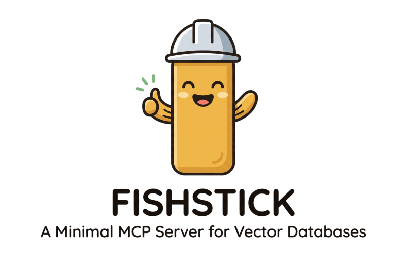

<h1 align="center">ministic-fishstick</h1>

<p align="center">
  
</p>

<p align="center">Minimal, high-performance Model Context Protocol (MCP) server for semantic code indexing and vector search powered by <i>Tree-Sitter</i>, <i>Qdrant</i>, and <i>Bun/TypeScript</i>.</p>

`ministic-fishstick` extracts code-indexing capabilities into a standalone MCP server that can be used directly with AI CLI agents (OpenCode, Claude Desktop, Cursor) as well as GitHub Copilot Agents in VS Code.

> [!IMPORTANT]
> This repository is now **deprecated** and **read-only**. Read below to discover why and what I learned about modern agentic development.

## Premise and Motivation

Previously I was using [Zoo Code](https://github.com/Zoo-Code-Org/Zoo-Code) in VSCode for a reasearch project that outgrew Google Colab. [Cline](https://github.com/cline/cline) was my entrypoint into agentic development, but I transitioned to Zoo Code because I felt like the harness was getting in the way of the model's reasoning ability. At first, Zoo Code was a major improvement. It handled all of my onerous tasks including adding docstrings, formatting new code, refactoring source code based on breaking changes I made, and generating small files or functions. Zoo Code also initially fulfilled my insistence on token conservation, and I gained a was able to get a lot done with models like Google's `gemini-3-flash-preview` rather than pro-tier models or Claude's Opus.

As I learned more, I quikcly transitioned my development workflow to **agent-first**. I see my role now as a competent senior engineer that should be delegating non-research tasks to code agents that are already code-context-aware, and I should be reviewing the PRs that come from those tasks making edits where necessary. Consequently, I quickly outgrew Zoo Code. It was especially aparent when one night I tried to generate a library from scratch based on LaTeX, Markdown, and Python code I had already written. Zoo Code struggled with a task like this making repeated API calls, choking on tool availability, and burning tokens; and after careful review, I wasn't convinced the model's reasoning ability nor my prompt engineering was to blame. It appeared the model was reasoning a response that didn't fit what Zoo Code expected in terms of tool selection. There was also a bug due to Google's recent enforcement in model turn lifecycle that helped prompt my move.

I switched to [OpenCode](https://github.com/anomalyco/opencode), and that same task was done first try in OpenCode proving my theory that the harness really was getting in the model's way. You could make the fair argument that perhaps I didn't understand how to setup or use Zoo Code properly, but I haven't looked back. I'm comfortable in the command line, and I liked OpenCode's design philosophy, token conservation and transparency, and customization. The only problem was OpenCode was missing the Qdrant-based code indexer that was a big selling feature of Zoo Code for me. My preliminary research didn't find any real equivalent Qdrant-based code indexing, and the projects that did didn't include the embedding model (Gemini's `text-embedder-001`) I was already using. I thought I had found a real gap in the open-source market, and since Zoo Code is Apache 2.0, I made a sparse fork of the repo and extracted the `code-index/` subpackage with OpenCode using `gemini-3.6-flash` and `ministic-fishstick` was born.

The following is documentation of what I learned along the way. Hopefully, it helps someone else out there learn from my experiences.

## Purpose and Planned Development

My goal was to create a [modern MCP server](https://github.com/modelcontextprotocol/servers) for code workspace indexing using [`tree-sitter`](https://github.com/tree-sitter/tree-sitter) for AST structure, [Qdrant](https://github.com/qdrant/qdrant) for vector storage, and broad embedder model support. Most of the logic was already written by the Roo Code and Zoo Code teams, so initially I thought all I had to do was wrap the [`code-index/`](https://github.com/Zoo-Code-Org/Zoo-Code/tree/e064cf0592cfc70735d86feff77f1265637697ae/src/services/code-index) repo in an MCP server, expose some tooling, and release it. I also planned to add Lean4 and Haskell support since my current research requires a Lean4 program for mathematic proofing of a custom density model I wrote. The project quickly grew in its refactoring effort as I removed telemetry for privacy, upgraded [Zod to v4](https://zod.dev/api), changed Zoo Code's use of JSON-based caching with fragile file-locking to [Bun's SQLite](https://bun.com/docs/runtime/sqlite), completely refactored error handling and logging with [LogTape](https://github.com/dahlia/logtape) to protect stdio, and more.

Below is a list of features I implemented and planned to implement for a v1 release:

- 🚀 **Bun Native & Fast:** Built with Bun for fast runtime, built-in SQLite support, compilable binaries for release, and native TypeScript toolchain.
- 🗄️ **Modern MCP Server Design**: 
  - Uses the most up-to-date protocol using `@modelcontextprotocol/server` rather than the deprecated but more prevalent `sdk`.
  - Careful tool design to protect against destructive actions.
- 🔍 **Semantic Code Search with Remote Qdrant and Local Vector Database Options:**
  - **Local Zero-Docker SQLite Vector Store:** Used for caching and optionally for vector storage running locally without needing Docker or external database services.
  - **Qdrant Vector Store Support:** Maintains Zoo Code's Qdrant vector storage that was a big selling point for me.
  - **Local [Semble](https://github.com/MinishLab/semble) Embedding and Vector Store:** Maintains Zoo Code's optional local embedding model and vector storage.
- 🌳 **Tree-Sitter AST Parsing:**
  - Maintains Zoo Code's Tree-Sitter parsing logic that uses [`web-tree-sitter`](https://github.com/tree-sitter/tree-sitter/tree/master/lib/binding_web) and [`tree-sitter-wasms`](https://github.com/sourcegraph/tree-sitter-wasms), so code is indexed based on logical and scoped captures preventing functions from being separated from their definitions etc.
  - Extended to include [Lean4](https://github.com/wvhulle/tree-sitter-lean) and [Haskell](https://github.com/tree-sitter/tree-sitter-haskell) query logic and compiled WASMs not included in `tree-sitter-wasms`.
  - Corrected Scala query and a silent bug that used Lua as the query for Tree-Sitter parsing.
  - Maintains `sha256` file hashing and passive directory scanner and file-watcher to prevent stale queries.
- 🔌 **Broad Embedder Model Support:**
  - Maintained and updated Zoo Code's embedder model support and deprecated old models.
  - Fixed an authentication issue with Amazon's Bedrock.
  - Maintained support for local embedder model reasoning.
- 🛡️ **Smart Ignore Rules (`.fishignore` + `.gitignore`):** Respects both workspace `.gitignore` and `.fishignore` patterns to exclude sensitive files or build output.
- ⚙️ **Tiered Configuration System:** Resolves configuration seamlessly across runtime MCP tool overrides, workspace `.fishstick.json`, global `~/.config/fishstick/fishstick.json`, `.env` files, and defaults.
- 💻 **Command Line Support:** CLI for on-the-fly configuration and database management with protections against agentic usage with both a confirmation requirement and TLS inspection.
- 🪵 **Detailed Error Logging:** Uses `LogTape` that sinks all console info messages to a memory buffer and logs to a file in the event of an error or fatal exception.
- 🌐 **International Language Support:** Maintains Zoo Code's `i18next` support specifically for common fatal errors that would cause an MCP crash due to config errors, missing API keys, etc.
- 🤖 **VSCode & Github Copilot Integration Ready:** Includes a `vscode-extension/` wrapper exposing native VS Code MCP Server contributions (`contributes.mcpServers`) and Copilot LM tools.
- 🏠 **Local Defaults:**
  - **Zero Telemetry:** Removed Zoo Code's telemetry service.
  - **Embedding Provider:** Defaults to **OpenAI** using `text-embedding-3-small` (requires `OPENAI_API_KEY`).
  - **Vector Store:** Defaults to local zero-docker **`sqlite`** storage located at `<workspace>/.fishstick/vectors.sqlite`.
  - **Local Cache:** Incremental file scan hashes stored in `<workspace>/.fishstick/cache.sqlite`.
  - **Target Directory:** Indexes the current working directory (`process.cwd()`).

## Why Did I Stop Pursuing the Project?

> A good engineer knows when to use AI and when to use other tools.

I was researching semantics about `tree-sitter` parsing as I was completing my refactor of parsing bugs and extending the queries to include Lean4, Haskell, and Scala. I was unhappy with how Zoo Code didn't seem to leverage the queries it had defined in its parsing algorithm, and I was looking into improvements. It was here that I learned how the embedder model fits into the vector reasoning on both the read and write lifecycles, and I discovered that *I was conflating two distinct methods of search and indexing: __structural__ and __semantic__.*

__Structural__ searches are deterministic and provide *exact* results. You perform structural searches when you type in a function name in the search bar of VSCode; the results are exact and based on regex string matches. Importantly, there is no *meaning* behind the search; there is no logical connection between two function implementations from an interface or similarity of function signature overloads or fuzzy matches of similar class names, for example. Structural searches are what tools like `grep` and `glob` return. __Semantic__ searches are what give *meaning* to given search patterns. These search results are **not** deterministic and vary widely based on model inference of probabilistic proximity in vector space. Semantic searches are powerful in that they establish logical connections between structurally unrelated things but are related by the meaning of keywords, phrases, and surrounding context.

Crucially, *code is largely __structural__*. Using text embedding inference as a primary indexing and search method for code is like trying to find meaning from an acorn. Of course, you *could* write poetry about an acorn, sing songs about its journey falling from the tree, and infer meaning about its shape and design; but it would be hard and inefficient to perform a deterministic structural analysis saying "this acorn is a product of the function of this tree which is the output of the function of the roots that output nutrition and leaves that output energy, and the acorn functions as an object that can spawn another tree inheriting the same species definition in its DNA." Text embedded reasoning is good at finding code that's semantically similar; it's bad at representing structural relationships. A code relationship, "this function calls that function", *isn't a meaning* to be embedded; **it's a structural edge**, and flattening structure into a single point in vector space is a documented failure mode [described by the FalkorDB Team](https://www.falkordb.com/blog/code-graph-is-the-secret/): 
> "A function's importance is defined by what calls it, what it calls, what it imports, and what it inherits from it. Embeddings flatten all of that into a single point in vector space, and 'near in vector space' is not 'connected in the call graph'. So the model fills the gap the way models do – confidently, and wrong."

Structural search problems such as "what calls a function" or "what would break if I change this" are **graph-traversal questions**. A graph already knows exactly what that is, where it is, and what references it, with perfect precision and zero inference. Semantic search problems, in contrast, ask "what does this component mean such that a differently-worded query would still reference it?" Embedder models excel in the legal and academic domains, for example, where cross referencing similar contract phrases and clauses or indexing topics across published papers or textbooks would truly benefit from the reasoning of an LLM. This process of semantic indexing and querying is more formally called Retrieval-Augmented Generation (RAG).

That's not to say that semantic searching is completely useless when applied to indexing and querying a codebase, but it solves a narrower problem. Its entire value proposition is *turn something ambiguous or unnamed into something findable by meaning*. That's powerful when the application is natural language — a docstring, a comment, a commit message. It's much weaker when the application is bare syntax because syntax is already precisely specified; there's no ambiguity in `Point = Point { x :: Int, y :: Int }` that a vector needs to resolve. But **semantic searching does genuinely excel when applied to prompts like "_find me the sorting function_"**. Embedder reasoning earns its keep specifically for questions like these — fuzzy, natural-language, intent-based queries — which are a real but smaller slice of what an agent actually asks. If someone prompts "find where authentication is checked before a request is processed," there's no symbol name to look up. This is a genuine *search by intent* problem, and it's where an embedding-reasoned first hop would be prudent before handing off to the graph for everything downstream of that first query answering "who calls it", "what does it depend on", and "what's its type signature". Indeed, AI researcher [Florian on Substack](https://aiexpjourney.substack.com/p/the-secret-behind-claude-codes-retrieval?utm_campaign=post-expanded-share&utm_medium=web) discussed the limits of pure structural search methods when concluding their reflection on Claude Code's source code leak and the code indexing architecture it revealed back in 1H2026:
> "Search results do not have the kind of semantic ranking a vector system could provide. Grep cannot find conceptually related code unless there is a matching token or pattern. LSP can fill some of that gap, but only when available and applicable. This means Claude Code’s approach is strongest when the task can be grounded in names, strings, paths, symbols, and concrete code evidence. It is weaker when the user asks a vague conceptual question and no obvious search terms exist."

The FalkorDB Team acknowledged this limitation in their blog and advocated for a hybrid approach, stating:
> "Vector search is excellent for semantic retrieval – 'find code that does something like X.' It’s the wrong tool for structural questions, where the answer is a path through the graph, not a similarity score. **The two are complementary**. Use embeddings to find a starting node by intent, then let the code graph walk the relationships from there. That hybrid is where the strongest codebase assistants land."

[Dean Rie](https://forum.cursor.com/t/code-index-fragment-association/160072/3), a Cursor developer, highlighted the challenges with RAG in Cursor's discussion board and gave a high-level architectual design pattern that echos what the Cursor Team is working on, saying:
> "A few approaches are worth combining, since no single one is enough on its own:
>
> 1. Hybrid retrieval, not just vector. Vector search alone often misses calling and called functions because their embeddings can look far from the request. Combine it with keyword search or grep over symbol names. Cursor uses semantic search plus grep for this reason...
>
> 2. Build a code graph at the AST stage ... This is usually the most reliable approach. Build a symbol and call graph at parse time, including definitions, references, imports, and class hierarchy. Then at retrieval time, take top-k from vector search and do 1 to 2 hops of graph expansion, like callees, callers, and type dependencies. Tree-sitter plus a language-aware symbol resolver like LSP, scip indexers, or stack-graphs is what many production setups use.
>
> 3. Do recursive or static analysis on the fly ... It can work, but it’s slower and harder to cache. It’s usually best as a refinement step on a small candidate set, not as the main retrieval method.
>
> 4. Add a reranker on top. After vector plus graph expansion, run a cross-encoder or LLM rerank against the user request. This can greatly improve precision and helps when chunk boundaries aren’t great.
>
> 5. Chunking matters too. Function-level AST chunking is good, but for short helper functions or methods in the same class, grouping them or attaching class and file context to each chunk often helps.
>
> For Cursor’s indexing approach, the public part is here [(Semantic & Agentic Search | Cursor Docs)](https://cursor.com/docs/agent/tools/search)..."

Based on this research and the understanding it brought, I realized the core logic of what I was wrapping in an MCP server was architecturally incorrect. Improving agentic reasoning about a codebase and reducing costs by improving token efficiency **requires a graph** for most codebase queries and a semantic reasoner for intent-based prompts. Zoo Code's `code-index` subpackage attempts to handle both through embedder reasoning alone, and that's architecturally inconsistent with what we've learned in the industry today. Moreover, this is a well-documented problem with numerous novel projects that attempt to solve it. My development time is better utilized by contributing to one of those projects, not reinventing my own unless I can propose a tertiary method. Indeed, what would have been my candidate proposal is already served by the following projects: [`sdsrss/code-graph-mcp`](https://github.com/sdsrss/code-graph-mcp) and [`DeusData/codebase-memory-mcp`](https://github.com/DeusData/codebase-memory-mcp). My reasoning is below.

## So, What's the Solution?

I contemplated several candidate open-source MCP projects, and before narrowing the list, my research pivoted to answering a refined question: **what design best offers modern coding agents efficient codebase context with _both_ structural and semantic insights?** As I learned more, I deduced this question into a set of requirements for a candidate project:

- **Should have minimal dependencies and written in a compiled language, preferably Rust.** This is personal preference. There are plenty or great projects written in TypeScript and Python, but I specifically wanted something *minimal*, as *least intrusive* on my system as possible, and *fast* at runtime. Personally, I prefer *Rust* or Golang since I find hacking at C/C++ laborious, but it wasn't a deal-breaker. But I did rule out anything that required a Docker container or a standalone DBMS server, like Memgraph or Neo4j. A single local binary with an embedded store was consistently preferred over anything needing separate infrastructure to function. This is a reflection of my own use-cases, but it's also resonant of a philosophy I'm developing — unless you're at the enterprise level indexing a codebase of thousands of files, code indexing should be a modular, minimal, and largely deterministic tool with semantic enhancements where appropriate.

- **Must use SQLite for caching and database management.** It suprised me in my research that a dedicated graph DBMS isn't actually necessary for structural code indexing, but most useful code-navigation queries — find callers, find definition, list a file's symbols — are 1-3 hop traversals, which SQL handles fine with an adjacency-list table and a recursive CTE. A dedicated graph engine generally isn't needed unless the application requires deep multi-hop pathfinding or graph algorithms (community detection, centrality), which most agentic coding tools would never actually need. Thus, the strength of [Neo4j](https://neo4j.com/), perhaps the most well-known graph DBMS written in Java, is needless for structural code indexing. [LadybugDB](https://github.com/LadybugDB/ladybug), the successor of KuzuDB before being aquired by Apple and often termed "the SQLite of graph databases", is written in C++ and more purpose-built for code indexing applications if the strength of a graph DBMS is required. Incidentally, none of the projects I surveyed currently use LadybugDB nor its predecessor.

- **Must include _both_ structural and semantic search capabilities.** This requirement is *constrained to reject projects that make embedder reasoning or RAG a primary feature* of their architecture. This is resonant of what I learned. A good engineer knows when to select the right tool, and the right tool features graph-based search mechanics as its core design philosophy and embedder reasoning as a secondary enhancement that handles the narrow use-case of semantic querying. This precluded projects like [`cocoindex-io/cocoindex-code`](https://github.com/cocoindex-io/cocoindex-code) which is entirely embedder-based reasoning, but it also precluded projects like [`vitali87/code-graph-rag`](https://github.com/vitali87/code-graph-rag) which had zero option for embedder reasoning.

- **No LLM in the query/retrieval loop.** I penalized projects that attempted to translate natural language into queries via an LLM, like [`vitali87/code-graph-rag`](https://github.com/vitali87/code-graph-rag) which attempts to translate NL into Cypher via an LLM API call. I prioritized MCPs that exposed deterministic tools directly to the calling agent. My reasoning is the calling agent itself *is* the reasoning layer, and there is no need for a second model mediating every lookup for my use-cases and scope.

- **Should not depend primarily on LSPs**: This completely excluded the very popular [Serena](https://github.com/oraios/serena) MCP. The idea of using an LSP server is novel in the idea that it leverages compiler/interpreter feedback and limited refactor capabilities, but I quickly developed two considerations that steered me away from these projects. First, it's contradictory to my minimalist value when it comes to tools like this. Serena adds a lot of dependencies and system weight that comes with the LSPs, and query responses no longer leverage the speed of a cached database but from a live server monitoring linting and code execution. It begged the question, "why not just use the LSP server directly?" Serena does add capabilities on top of a given LSP server that's genuinely useful, and the recent addition of the semantic search tool was a selling point. One could make the argument that LSP-based querying is *exact*, *deterministic*, and eliminates the possibility of stale query results; but in comparison to other solutions, I wasn't convinced. The one use-case I have that would truely benefit from LSP-based queries is my development in Lean4, but that has an arguably much stronger MCP project [(`oOo0oOo/lean-lsp-mcp`)](https://github.com/oOo0oOo/lean-lsp-mcp) that wraps the Lean LSP and natively manages the complexity of the Lean language. For all the other dominant languages I write in (Python, JavaScript/TypeScript, Golang, Rust, Swift), I preferred a direct graph-based project.

- **Must have stale index logic:** 
- **Incremental re-indexing, not full re-scans.** You favored designs with content-hash-based dirty propagation (BLAKE3 Merkle diffing) over anything that recomputes the whole graph on every change, flagging vitali87's full-recompute-on-file-change behavior as a scalability concern.

- **Read-only/analysis-first scope, not mandatory code-editing.** My whole purpose for building `ministic-fishstick` was to reduce my agents' need to use `grep`, `glob`, and read actions that needlessly burn tokens when codebase context can be represented more efficiently. Code refactoring and code generation, to me, is categorically a different task. Code formatting itself is solved at save-time with tools like [`prettier`](https://github.com/prettier/prettier). Beyond generating docstrigns, an LLM is completely unceessary for code style enforcement. Code editing and writing is better handled by other agentic capabilities; although, I did note that the inclusion of line number metadata in a query result was a powerful feature not seemingly included by many projects. 

- **Proportionate feature scope for a solo/personal-project use case.** I heavily discounted enterprise-oriented features — cross-repo graphs, IaC/K8s indexing, team-shared snapshot artifacts, multi-service pub-sub tracing. I consistently used the "do I need this?" as a filter against otherwise-impressive feature lists. Scope in any context is crucial, and it is a documented phenomenon that just handing a model more tools is actually counter-productive.

- **Maturity/competence signal from direct code review, not just star count.** I admire indie projects, and I didn't treat GitHub stars as sufficient evidence for the integrity or maturity of a candidate project. This is where Github's Copilot is an absolute game changer. I personally audited the codebases of my shortlist both through Copilot's help and manual review of pertinent code for security considerations, configurability, and adherence to my requirements before trusting the maintainer's claims. There are some great projects out there, and Copilot has transformed my project discovery.

- **Fail-closed, verifiable integrity for anything fetched over the network.** Your review of sdsrss's BLAKE3/sha256 pinning, HTTPS-downgrade rejection, and "refuse install if unverified" policy suggests you weight supply-chain integrity for snapshot/model downloads, even though you calibrate the bar to your actual (single-user, local VM) threat model rather than demanding enterprise-grade hardening.

### Primary Condidate
what i like about it

### Runner Up
reference the codebase-memory academic paper

NO RTK!
AGENTS.md and config considerations to prohibit reads as a part of the solution. reference the audit from sdsrss and the research from claude-perplexity on how the models are biased/trained to use grep and will prefer it even if a better tool exists as an option.

---

## Getting Started

> [!WARNING]
> This project is deprecated and unfinished. The following is intended getting started behavior but may not work or be fully implemented.

### Prerequisites

- **Bun** (v1.1+): Install via `curl -fsSL https://bun.sh/install | bash`
- An OpenAI API Key (or an alternative supported provider like Ollama, Gemini, Mistral, Bedrock, etc.)

### Installation & Local Setup

```bash
# Clone the repository
git clone https://github.com/your-org/ministic-fishstick.git
cd ministic-fishstick

# Install dependencies
bun install

# Run tests
bun test

# Type-check
bun check-types
```

## Usage

> [!WARNING]
> This project is deprecated and unfinished. The following is intended usage behavior but may not work or be fully implemented.

#### 1. Running as an MCP Server (Stdio)

Start the stdio MCP server directly using Bun:

```bash
OPENAI_API_KEY="sk-..." bun run src/index.ts
```

#### 2. Configuring in OpenCode / Claude Desktop / Cursor

Add `ministic-fishstick` to your MCP client configuration (e.g. `opencode.json` or `claude_desktop_config.json`):

```json
{
  "mcpServers": {
    "fishstick": {
      "command": "bun",
      "args": ["run", "/path/to/ministic-fishstick/src/index.ts"],
      "env": {
        "OPENAI_API_KEY": "sk-...",
        "VECTOR_STORE_PROVIDER": "sqlite"
      }
    }
  }
}
```

#### 3. VS Code Copilot Agent Integration

For VS Code users, the included `vscode-extension/` folder provides an extension wrapper:
1. Open `vscode-extension/` in VS Code or install the compiled extension package.
2. The extension automatically registers `fishstick` in VS Code's native MCP server catalog and exposes the `fishstick_search_code` tool to GitHub Copilot chat participants and agents.

### Available MCP Tools

The server exposes five core MCP tools:

| MCP Tool Name | Description |
|---|---|
| `code_index_search` | Perform semantic vector search over the indexed codebase. Accepts `query`, optional `directoryPrefix`, and `workspacePath`. |
| `code_index_start` | Trigger background directory scan and file watcher (`chokidar`) for a workspace folder. |
| `code_index_status` | Retrieve current indexing state (`Standby`, `Indexing`, `Indexed`, `Error`), block counts, and file watcher progress. |
| `code_index_clear` | Clear vector database tables and local cache files for a workspace. |
| `code_index_configure` | Dynamically update embedding provider, model ID, search minScore, maxResults, or vector store at runtime. |

### Configuration Hierarchy

Configuration is resolved automatically in the following order of precedence (highest to lowest):
- Priority 1: Dynamic MCP Tool Calls (`code_index_config`)
- Priority 2: Workspace Config (`.fishstick.json`) 
- Priority 3: Global User Config (`~/.config/fishstick/fishstick.json`)
- Priority 4: Environment Variables (`.env`) / Defaults

#### Example `.fishstick.json` or `~/.config/fishstick/fishstick.json`

```json
{
  "enabled": true,
  "vectorStore": {
    "provider": "sqlite",
    "qdrantUrl": "http://localhost:6333"
  },
  "embedder": {
    "provider": "openai",
    "modelId": "text-embedding-3-small",
    "apiKey": "sk-..."
  },
  "search": {
    "minScore": 0.3,
    "maxResults": 20
  }
}
```

#### Environment Variables (`.env`)

| Variable | Description | Default |
|---|---|---|
| `OPENAI_API_KEY` | OpenAI API Key for default embedder | — |
| `VECTOR_STORE_PROVIDER` | `sqlite` (zero-docker local) or `qdrant` | `sqlite` |
| `QDRANT_URL` | Qdrant database server URL | `http://localhost:6333` |
| `EMBEDDER_PROVIDER` | Embedder provider (`openai`, `ollama`, `gemini`, etc.) | `openai` |
| `EMBEDDER_MODEL_ID` | Model identifier | `text-embedding-3-small` |
| `SEARCH_MIN_SCORE` | Similarity score cutoff (0.0 to 1.0) | `0.3` |
| `SEARCH_MAX_RESULTS` | Max results returned by search | `20` |

### Ignore Rules (`.fishignore` + `.gitignore`)

`ministic-fishstick` uses `FishIgnoreController` to filter files before parsing and indexing:
- **`.gitignore`**: Automatically respected if present in the workspace.
- **`.fishignore`**: Custom ignore file for indexing rules (uses standard `.gitignore` glob syntax).
- **Auto-ignored:** `.git`, `.fishignore`, `.fishstick.json`, `node_modules/`, binary files, and vector database caches are always excluded.

## License

Apache 2.0 © 2026 Israel Flores-Arbolay.

## Credit

[The Zoo Code Team](https://github.com/Zoo-Code-Org/Zoo-Code)